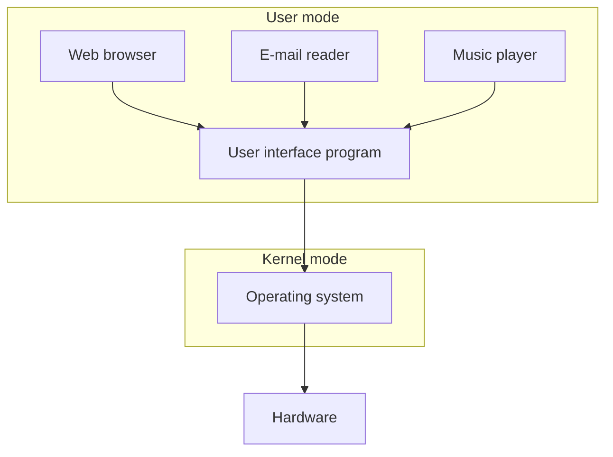

## What Is an Operating System, Really?

Before defining anything formally, it's worth noticing just how many operating systems already surround you. Desktops, laptops, and servers run Windows, macOS, Linux, Unix, FreeBSD, or OpenBSD. Smartphones, smart watches, and smart TVs run Android, iOS, Blackberry OS, or Symbian. Networking devices and routers run Cisco IOS or OpenWrt. Even the tiny embedded devices behind the Internet of Things run their own specialized operating systems: Contiki OS, RIOT, OpenWSN, TinyOS. The concept scales from a phone in your pocket down to a battery-powered sensor the size of a coin.

### What Do Operating Systems Actually Do?

At the core, an operating system **manages** and **abstracts** resources. It sits between the raw hardware and the software that people actually use, and it does this in layers:

Applications like a web browser, an email reader, or a music player run in **user mode**, on top of a user interface program. Beneath that, the **operating system itself** runs in **kernel mode**, and beneath that sits the raw hardware. This user mode/kernel mode split, and exactly why it exists, is explored in much more depth in Week 2.

It's worth asking directly: are there computer systems that don't use an operating system at all? Yes, this is called running **bare metal** (or "bare machine"), where software talks to the hardware directly with no OS layer in between at all. This is unusual for general-purpose computing, but shows up in some of the smallest embedded devices, where the overhead of a full OS isn't justified.

## Practical Information About the Course

### 02159 and 02335: One Course, Two Codes

In 2026, course codes 02159 and 02335 run as literally the same course: same classroom, same lectures, same project. If you're enrolled under either code, you're in the right place.

### Why Hands-On Assignments Matter

A striking statistic from 2018 makes the case for taking the hands-on work seriously: students who completed _all_ the hands-on assignments averaged 10.2 out of 12 in their final grade, while students who completed only the _mandatory_ assignments averaged just 6.6 out of 12. That's a substantial gap, and it points to a simple conclusion: hands-on assignments facilitate deep learning in a way that passive lecture attendance alone doesn't.

### The OS Challenge

Building directly on that insight, the course frames its hands-on programming work as something more engaging than a checklist of assignments: the **OS Challenge**. The idea is simple, make it fun. The hands-on programming assignments get converted into a game, so you learn operating systems concepts by actually playing it, and the team producing the best solution to the challenge wins.

The OS Challenge draws its structure from **Problem-Based Learning (PBL)**. In a PBL setup, students form groups and are handed a problem, not a set of instructions. The group itself breaks that problem down into sub-problems, identifies what knowledge it's missing, and sets its own individual learning objectives to fill those gaps. The teacher's role shifts from providing solutions to _facilitating_ the process, supplemented by lectures that assist students towards finding the solution themselves, rather than handing it to them directly.

### Course Structure: Learning Activities

The course runs on two main tracks. **Lectures** (with video lectures also available) discuss the operating systems concepts for the week and are specifically designed to inspire ideas for tackling the OS Challenge, supplemented by additional video lectures and self-study material on C programming and TCP/IP networking, for students who need to shore up those foundations. The **OS Challenge itself is the course project**, and some weeks deliberately have no lecture at all, freeing up that time for focused project work with direct TA support.

### Teaching Staff

The main teacher is Xenofon (Fontas) Fafoutis (xefa@dtu.dk), supported by co-teachers Charalampos (Haris) Orfanidis (chaorf@dtu.dk) and Roberto Morabito (romor@dtu.dk), along with a team of teaching assistants whose contact details are posted on DTU Learn.

### A Typical Week: Where, When, What

The rhythm of a typical week has three parts. **Homework, prior to the lecture** (done anywhere): watch the weekly video lecture, study the theory, or catch up on the project. **Lecture days**: the lecture itself, followed by a group meeting to discuss the lecture and project, plus project work time. **Project days**: group meetings to discuss the lecture and project, project work, and the chance to get direct support from the TAs.

### About the Main Teacher

Xenofon (Fontas) Fafoutis is originally from Greece and earned his PhD from DTU Compute in 2014. He spent over four years as a researcher in Bristol, UK, before joining the faculty at DTU Compute in August 2018, within the Embedded Systems Engineering section. His research interests center on wireless embedded systems, embedded AI, low-power networks, and the Internet of Things, a background that directly explains why the Week 2 material draws on real embedded sensor hardware as a running example. Students interested in a final year project in this space are pointed to his personal page at compute.dtu.dk/~xefa.

### Communication and Language

Course announcements go out on DTU Learn, so it's worth actually checking your email regularly rather than relying on remembering to log in. The course website lives on DTU Learn, and Fontas's email is xefa@dtu.dk; his office (322/120) is available by appointment only. The course runs entirely in English.

### Reading Material

The core textbook is A. S. Tanenbaum and H. Bos, _Modern Operating Systems_, 5th edition (Pearson Education Inc., 2023). The cover itself doubles as a handy summary of the field: it lays out five core functions of an operating system arranged like petals around a center, processor management, memory management, security, file management, and error detection, all organized under the umbrella of "functions of an operating system." Additional material beyond the textbook will be linked directly on DTU Learn as the course progresses.

### Assessment

Overall assessment combines a **mandatory group project** with a **final written examination**. The OS Challenge portion is graded based on how well the objective learning criteria are met, explicitly _not_ based on how your team ranks against other teams, so there's no incentive to sabotage or hide work from classmates. The final written examination allows all aids, open book, open notes, open everything, which shifts the real challenge away from memorization and toward genuinely understanding how the concepts fit together.