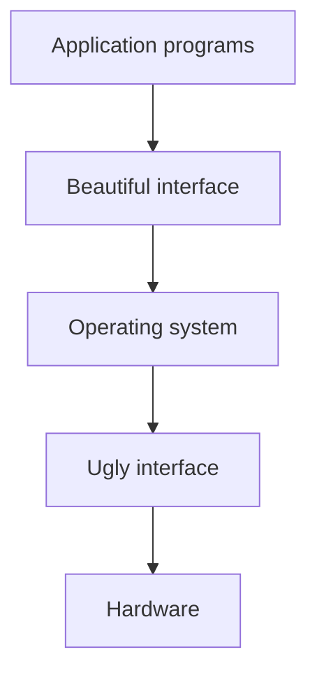
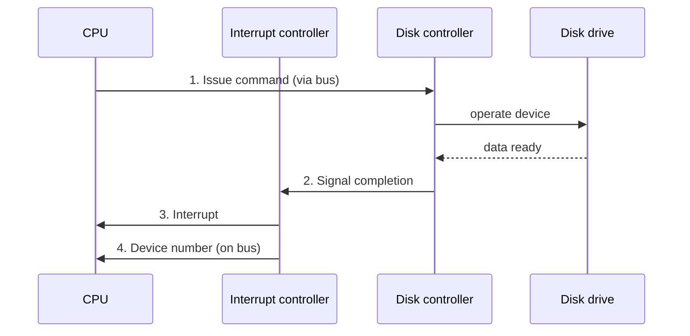
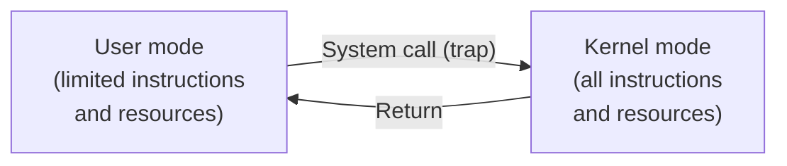
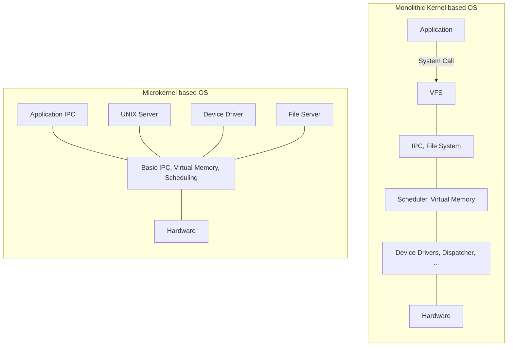

## From Nasty Hardware to Beautiful Abstraction

Operating systems abstract and manage resources, and it's worth internalizing just how large the gap is between what they hide and what they present. Picture the hardware layer as genuinely ugly, unpredictable timing, inconsistent interfaces across devices, a mess of registers and controllers, represented in Tanenbaum's classic textbook illustration as a row of snarling monsters. The operating system sits directly on top of that mess, and what it hands up to application programs is, by contrast, clean and pleasant to work with, represented in the same illustration as elegant figures: a princess, a castle, a peacock, a flower. That's the operating system's whole job in a nutshell: take a genuinely nasty interface and turn it into a beautiful one.



Since the operating system is the layer that talks directly to the hardware, understanding what it's actually managing means first understanding what the hardware itself looks like.

## Computer Hardware Review

A modern computer system is built from a recognizable set of parts: one or more processors, main memory, disks, CD/DVD drives, printers, a keyboard, a mouse, a display, network interfaces, and a whole category of other I/O devices. The rest of this note works through the parts that matter most for how an operating system actually functions.

## The Processor (CPU)

The CPU is, informally, the brain of the computer. Concretely, what it does is fetch instructions from memory and execute them, where those instructions fall into three broad categories: data handling instructions (read, write), arithmetic and logic instructions (add, divide, compare), and control flow instructions (jump, call). To do this, the CPU relies on **registers**, small pieces of extremely fast on-chip storage. General purpose registers hold things like key variables and temporary results, while special registers serve dedicated roles, the program counter (tracking which instruction comes next) and the stack pointer being the classic examples.

### Introducing Parallelism

Modern CPUs don't execute one instruction fully before starting the next. **Instruction pipelining** separates the work into distinct fetch, decode, and execute units, so that while one instruction is being executed, the next is already being decoded, and the one after that is already being fetched. A **superscalar CPU** takes this further by adding specialized execution units, for example a dedicated floating-point unit, so genuinely different kinds of work can happen in parallel within a single core.

### Multithreaded and Multicore Processors

**Multithreading** gives a single core the ability to hold the state of two (or more) execution threads at once, and switch between them extremely fast, in a kind of pseudo-parallel execution. This is especially useful when one thread stalls waiting on something slow, like fetching data from memory, since the CPU can switch to the other thread rather than sitting idle during the wait.

**Multiple processors** (commonly 4, 8, 16 or more cores) provide genuinely true parallelism rather than the pseudo-parallelism of multithreading, since separate cores really are doing separate work at the same instant. A Graphics Processing Unit (GPU) pushes this to an extreme, offering a very large number of simpler cores optimized for the kind of massively parallel work graphics (and, increasingly, machine learning) require.

## Memory

There's an old constraint in computer architecture: you want memory to be fast, large, and cheap, but you can only ever pick two of the three. No single memory technology satisfies all three at once, which is exactly why real systems use **layered memory** instead of one uniform pool: small, extremely fast (and expensive) memory close to the CPU, backed by progressively larger, slower, and cheaper memory further away.

### The Principle of Locality

This layered approach only actually helps if there's a reliable way to guess which data should live in the fast, expensive layer (the cache) at any given moment. The honest answer is that the system doesn't _know_, it has to guess, but it can make very good guesses by relying on the **principle of locality**: a program accesses a relatively small portion of its address space at any given instant.

This principle splits into two distinct types. **Temporal locality** (locality in time): if an item is referenced once, it will tend to be referenced again soon. **Spatial locality** (locality in space): if an item is referenced, items whose addresses are close to it tend to be referenced soon as well.

### Cache Memory: Implications for Programming

Locality isn't just a hardware detail, it directly shapes how fast your own code runs. Consider a simple example, summing every element of a large two-dimensional array:

```c
int a[1000][1000];
int c = 0;

for (i=0; i<1000; i++)
    for (j=0; j<1000; j++)
        c += a[i][j];
```

versus the same loop with the indices swapped:

```c
int a[1000][1000];
int c = 0;

for (i=0; i<1000; i++)
    for (j=0; j<1000; j++)
        c += a[j][i];
```

These two loops touch exactly the same set of memory addresses and compute exactly the same result, but they access memory in a completely different order. A 2D array is laid out in memory row by row, so `a[i][j]` walks through memory sequentially as `j` increases, exhibiting strong spatial locality, each access is right next to the previous one, so it's very likely to already be sitting in cache. The swapped version, `a[j][i]`, jumps a full row's width in memory on every single access, which tends to miss the cache far more often, in practice, this version can run dramatically slower, even though the arithmetic is identical.

The general lesson: caches depend on locality to work, so your code has to actually exhibit locality to benefit. For temporal locality, make sure any reuse of the same data happens shortly after its prior use. For spatial locality, cluster reused data together, and cluster together data that tends to be accessed shortly after each other, exactly the fix the row-major loop above demonstrates.

### Real Hardware: Quad-Core Cache Architectures

Real multicore chips organize their cache hierarchy in different ways. One layout has four cores connected to each other and to a shared cache over a common internal bus. Another gives each core its own private L2 cache, with an L1 cache sitting even closer to each individual core. On Linux, you can inspect your own machine's actual cache structure directly with `lscpu`, or with `getconf -a | grep -i cache`.

## Input/Output Devices

I/O devices generally come with a **controller**: a small computer chip that physically operates the device on the computer's behalf. Controllers typically have their own processor (often not programmable by the end user), their own registers, and sometimes their own memory, and they accept commands issued by the operating system rather than being driven directly by the main CPU.

The operating system talks to a controller through a **device driver**, a piece of OS software written specifically for that controller. How a driver actually gets into the running kernel has evolved over time: in the old days, adding a driver meant relinking the entire kernel from source; later, the OS gained the ability to load drivers automatically at boot time; and more recently, drivers are loaded on the fly as devices are plugged in, what's commonly called plug and play.

### Accessing the Memory and Registers of I/O Devices

Controllers expose their memory and registers to the rest of the system through **abstraction**: their memory-mapped registers get mapped directly into the system's address space, so the CPU can read or write them exactly like any other memory address, with no special instructions required.

Beyond that mapping, actual communication with a device can happen in three different ways, in increasing order of sophistication. **Busy waiting**: send a command, then sit in a loop repeatedly checking whether it's done yet, simple, but wastes CPU cycles the whole time the device is working. **Interrupt-based**: send a command and let the CPU go to sleep (or do other work); the controller itself generates an **interrupt** once it's finished, actively signalling completion rather than making the CPU poll for it. **Direct Memory Access (DMA)**: a dedicated chip that can move data directly between a controller and main memory without the main CPU being involved in the transfer at all, freeing the CPU up completely for the duration of the transfer.

### Interrupts, Step by Step

The interrupt mechanism itself has a concrete, four-step structure worth walking through. Picture a CPU issuing a read command to a disk controller: (1) the CPU sends the command to the disk controller over the bus, which then operates the physical disk drive. Once the requested data is ready, (2) the disk controller signals the interrupt controller. That interrupt controller then (3) actually interrupts the CPU, and (4) puts the specific device number on the bus, so the CPU knows exactly which device raised the interrupt, and can dispatch to the correct handler.



From the CPU's own point of view, an interrupt breaks into its normal instruction stream at an arbitrary point: it's midway through executing the current instruction and about to move to the next one, when (1) an interrupt arrives. The CPU (2) dispatches to the interrupt handler, runs that handler to completion, and then (3) returns to exactly where it left off, resuming the next instruction as though nothing had happened, apart from the time the handler took.

## Buses

A bus is simply a communication line connecting parts of the computer together, and buses vary along two independent dimensions. By width of transfer: **serial** buses move one bit at a time, while **parallel** buses move a whole word (for example, 32 bits) at once. By sharing: a **dedicated** bus is allocated exclusively to two specific components, while a **shared** bus is used by multiple devices in turn.

### The Structure of a Real x86 System

Putting all of this together, a real x86 system's block diagram shows how these pieces actually connect. Two CPU cores, each with their own cache, sit behind a shared cache and connect (via PCIe) to a graphics chip and (via memory controllers) to DDR3 main memory. Below that, a DMI link connects to a Platform Controller Hub, which fans out to PCI slots, SATA (for disks), USB 2.0 and 3.0 ports, Gigabit Ethernet, and further PCIe devices. Every box in this diagram maps directly onto a concept already introduced above: cores, caches, memory controllers, and I/O controllers (SATA, USB, Ethernet) all connecting through a hierarchy of buses.

### The Structure of a Real Sensor System

The same underlying structure, processor, memory, and I/O, shows up at a radically smaller scale in an embedded sensor. The SPHERE wearable sensor, a piece of hardware built around a CC2650 System-on-Chip and an ADXL362 accelerometer, packs an ARM Cortex-M3 main CPU, flash, SRAM, and ROM alongside a dedicated ARM Cortex-M0 sensor controller and a full RF core for wireless communication, all fitting on a board small enough to sit inside a wristband. It's the same computer organization principles from the earlier sections of this note, just compressed dramatically.

## CPU Modes of Operation

CPUs support (at least) two operating modes, and the difference between them is central to how an operating system actually protects itself and its users. In **kernel mode**, the CPU can execute every instruction and use every piece of hardware; the operating system itself typically runs here. In **user mode**, the set of allowed instructions and accessible hardware resources is deliberately limited, and every ordinary user program runs here. To reach a protected resource from user mode, a program has to make a **system call**: normal execution is suspended, and the operating system takes control through what's called a **trap**.



### Why User Mode at All?

It's worth asking directly why systems bother with this split, rather than just running everything in kernel mode all the time. Three real benefits justify the cost. It **enables the operating system to enforce management policies**, since applications can only reach protected resources by going through the OS, never around it. It provides **stability through isolation**, a bug in a user-mode program cannot, by construction, take down the entire system the way a kernel-mode bug can. And it provides **security in multi-user systems**, preventing one user's process from freely reaching into another's.

The cost is real too: transitioning between user mode and kernel mode is genuinely expensive computationally, so systems face a direct trade-off between how much protection they enforce and how efficient they can be.

## Operating System Structure

An operating system provides a large number of services, and a fundamental design question follows directly from the user mode/kernel mode split above: which of those services should actually run in kernel mode, and which in user mode? This is fundamentally a **stability versus efficiency trade-off**: kernel mode is fast but dangerous (a bug there can take the whole system down), user mode is safer but slower (every reach into a kernel-mode resource costs an expensive mode transition). Different operating system architectures answer this question differently.

### Monolithic Systems

In a monolithic system, the entire OS runs as a single program in kernel mode, and user programs reach OS services exclusively through system calls. The advantage is real efficiency: within the OS, every resource and service is directly accessible to every other part of it, with no expensive boundary crossings internally. The disadvantage is equally real: a bug in any one OS service can take down the entire system (a buggy audio driver could, in principle, accidentally write onto the disk), and the design is less flexible, since any system extension requires rebuilding the kernel itself.

### Layered Systems

A layered system organizes the OS as a hierarchy of layers, where inner layers are more privileged than outer ones. This buys high flexibility: it's easy to extend the system as long as a new layer respects its interface with the layer immediately above and below it. The cost is lower efficiency, since a procedure in an outer layer may need the equivalent of multiple system calls just to reach an inner resource, and in practice, deciding exactly where to draw the boundaries between layers is genuinely difficult to get right.

### Microkernels

A microkernel takes the opposite approach from a monolithic design: keep the kernel itself very small, typically just basic process and memory management plus message passing, and push every non-essential OS service out into user mode, communicating with each other and with the kernel via message passing. This gives high stability, a bug in a driver running as a user-mode service cannot take the entire system down, and high flexibility, extending the system doesn't require rebuilding the kernel at all. The cost is high overhead from all that message passing between services that, in a monolithic design, could have just called each other directly.



In the monolithic diagram, everything from the virtual file system down to the device drivers runs inside one kernel-mode block. In the microkernel diagram, the application, the UNIX server, device drivers, and the file server are all separate user-mode components sitting on top of a genuinely minimal kernel that provides nothing but basic IPC, virtual memory, and scheduling.

### Hybrid Systems

In practice, many modern operating systems don't strictly follow either the pure monolithic or the pure microkernel model, blending ideas from both. The NT kernel, used in Windows since the early 2000s (including on phones and the Xbox), and the XNU kernel, used across macOS, iOS, and watchOS, are both real-world examples of this hybrid approach, borrowing efficiency from the monolithic side and modularity from the microkernel side where it makes sense for each system.

## A Closing Note

This whole monolithic-versus-microkernel discussion isn't just an academic design exercise, it's historically been a genuinely contentious debate in the field. In 1992, Andrew Tanenbaum (the author of this course's textbook) and Linus Torvalds (creator of Linux) publicly argued on Usenet over exactly this question, with Tanenbaum, an advocate for microkernels, at one point suggesting Linux's monolithic design already made it obsolete. Linux, of course, went on to become one of the most widely deployed kernels in the world, monolithic design and all, a reminder that engineering trade-offs like the ones covered in this note rarely have a single, universally correct answer.